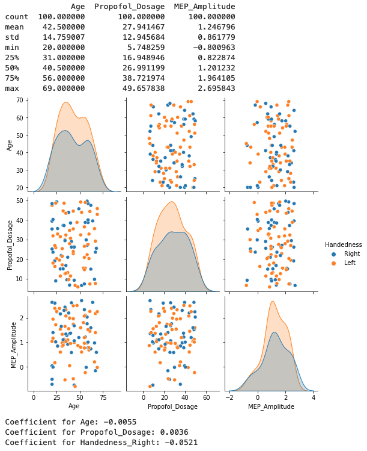
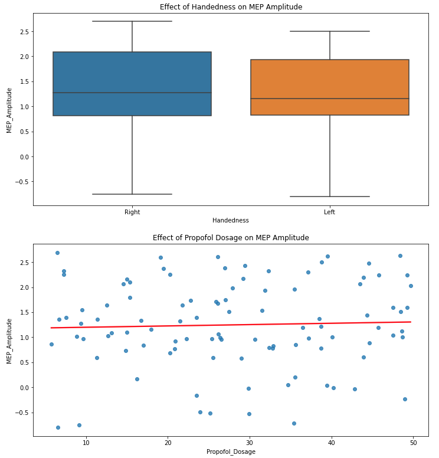
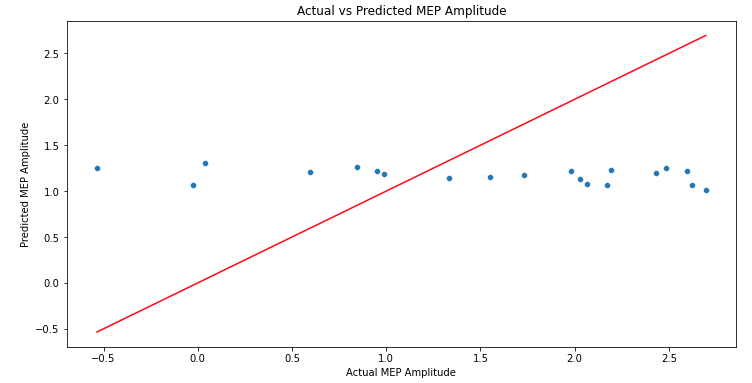
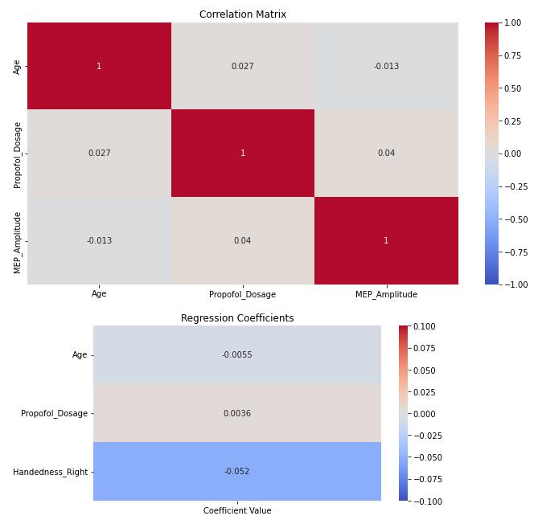
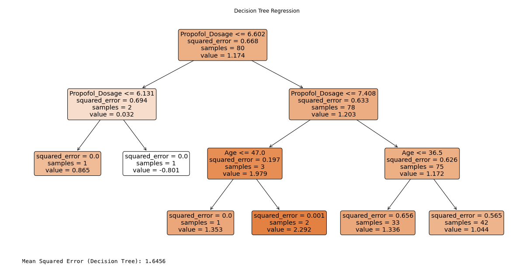

**Analysis of MEPs and the Effect of Handedness and Propofol**
This is just a machine learning pratice. 

### Introduction to Motor Evoked Potentials (MEPs):

Motor Evoked Potentials (MEPs) are neurophysiological measures used to monitor the functional integrity of the motor pathways, specifically those of the corticospinal tract. They are elicited through direct stimulation of the motor cortex, typically via magnetic transcranial stimulation, which results in a downstream muscular response. The amplitude and latency of the MEPs can offer insights into the functional state of the motor pathways.

### Why Investigate Handedness and Propofol?

**Handedness:** Handedness, which determines whether one is left or right-handed, can influence the dominance and size of the corresponding motor cortex. This may lead to differences in MEP amplitudes. Particularly, when MEPs are recorded from muscles like the right FDI (First Dorsal Interosseous), differences between left and right-handed individuals can be anticipated due to the lateralized nature of motor functions.

**Propofol:** An intravenous anesthetic agent, propofol is used in various surgical and diagnostic procedures. According to research like that by M. Taniguchi et al., propofol, along with other anesthetic agents, can influence the amplitude of MEPs. Notably, the study found that propofol had a significant suppressive effect on MEP amplitudes, even leading to complete abolition in certain cases. Thus, understanding the relationship between propofol dosage and MEP amplitude can be invaluable, especially in clinical contexts like intraoperative (e.g., neurosurgery) monitoring.

### Purpose of this Machine Learning Practice:

The aim of this machine learning (ML) analysis is to understand and predict how handedness and propofol dosage might affect the amplitude of MEPs recorded from the right FDI muscle. This exercise serves as a stepping stone towards more advanced analyses that can potentially be used in clinical or research settings to inform decision-making and understand motor pathway dynamics.

### Machine Learning Methods:

This ML approach involves building a regression model to predict MEP amplitude based on given features: age, handedness, and propofol dosage. The following is a brief overview of the methods and functions used:

1. **Data Exploration:** Initial data visualisation using `sns.pairplot` helps provide insights into the relationships and distribution of variables.

2. **Data Preprocessing:** The data contains both numerical (Age, Propofol_Dosage) and categorical (Handedness) features, we employ a `ColumnTransformer` to process these features appropriately. Specifically, we use `OneHotEncoder` to transform the categorical feature 'Handedness' into a format suitable for ML models.

3. **Linear Regression Model:** A simple yet effective algorithm, `LinearRegression`, is used to determine the relationship between the independent variables (Age, Handedness, Propofol_Dosage) and the dependent variable (MEP_Amplitude).

4. **Model Evaluation:** We use the `mean_squared_error` to quantify the model's accuracy. This metric gives an average squared difference between predicted and actual MEP amplitudes.

5. **Visualisation:** Several visualizations are incorporated, such as the effects of handedness and propofol dosage on MEP amplitude using `sns.boxplot` and `sns.regplot`, respectively. Additionally, a scatter plot provides a comparison between actual vs. predicted MEP amplitudes.

By leveraging these methods, this analysis hopes to shed light on the nuances of how propofol and handedness might influence MEP amplitude, potentially offering insights for further research and clinical applications.

### Output and Interpretation:

**Coefficient for Age: -0.0055**
   
   For every year increase in age, the MEP amplitude decreases by 0.0055 units, keeping all other variables constant. This indicates an inverse relationship between age and MEP amplitude. However, the effect seems small and might not be clinically significant, but this depends on the units and scale of MEP amplitude.

**Coefficient for Propofol_Dosage: 0.0036**
   
   For every unit increase in Propofol dosage, the MEP amplitude increases by 0.0036 units, keeping all other variables constant. This indicates a direct relationship between the dosage of Propofol and MEP amplitude. Again, the magnitude of the coefficient is small, which might indicate that while Propofol dosage does have an effect on MEP amplitude, it's not a very strong effect by itself.

**Coefficient for Handedness_Right: -0.0521**
   
   This coefficient compares right-handed to left-handed individuals. A right-handed person, on average, has a MEP amplitude that's 0.0521 units lower than a left-handed person, when all other factors are kept constant. This suggests that handedness, particularly being right-handed, has a slightly more pronounced (though still modest) negative effect on MEP amplitude compared to the other factors we looked at.

**Mean Squared Error (MSE): 1.6456**

   The MSE provides a measure of the average squared difference between predicted and actual MEP amplitude values. The smaller the MSE, the closer our predictions are to the actual values, which indicates a better model. An MSE of 1.6456 gives us a rough idea about the accuracy of our predictions, though to really gauge how good or bad this is, one would typically compare it to other models or benchmarks. 

*Note: This is a synthetic dataset. Real-world data might present different relationships, and statistical significance tests are also necessary to validate the observed effects.

    

  

Remy Cohan, 2023
